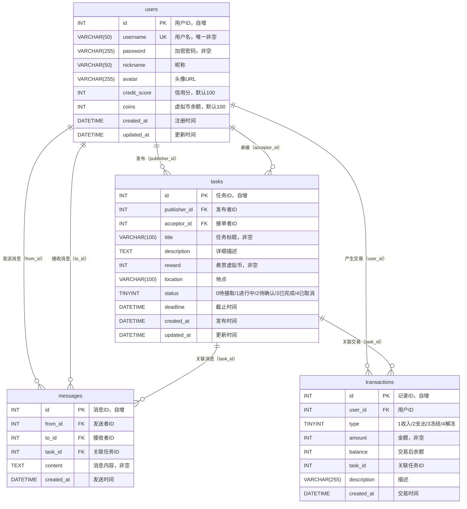
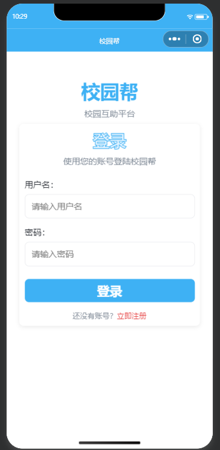
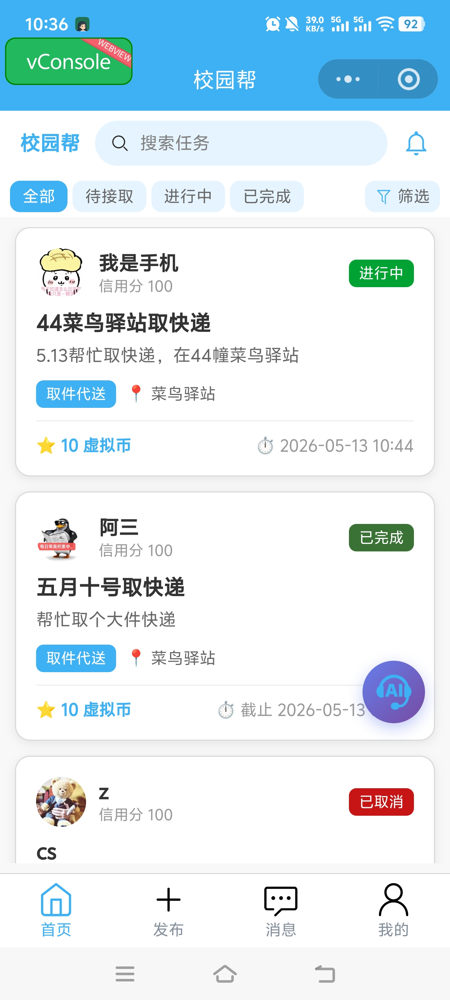
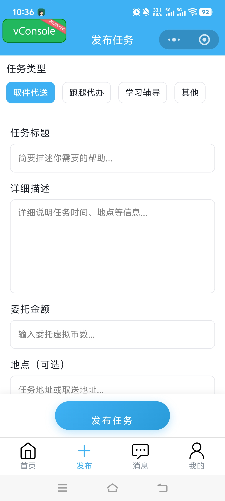
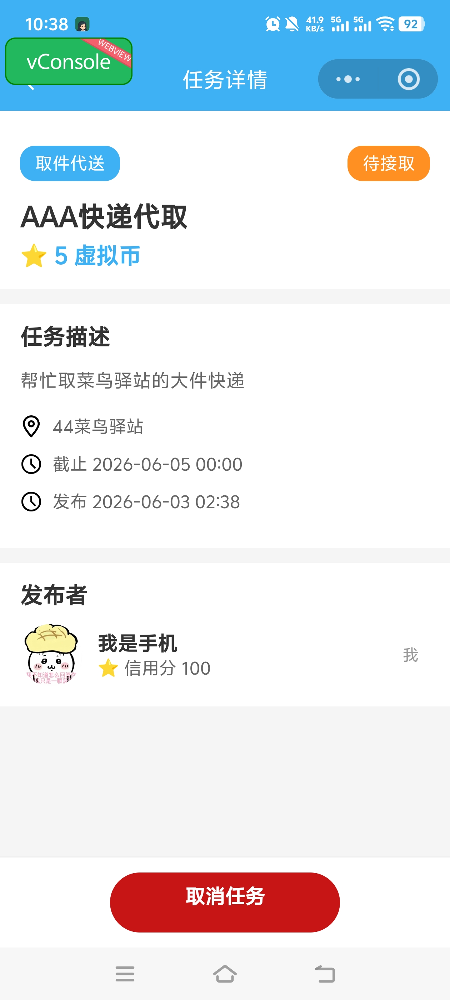
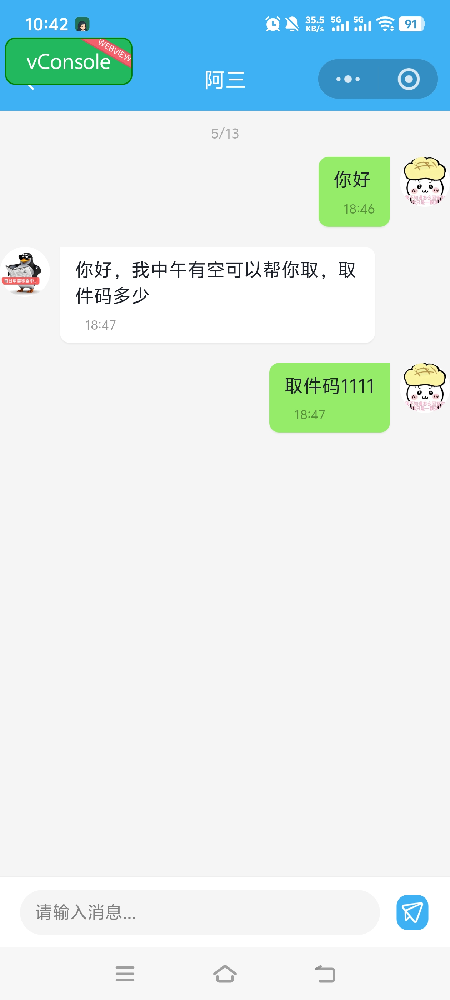
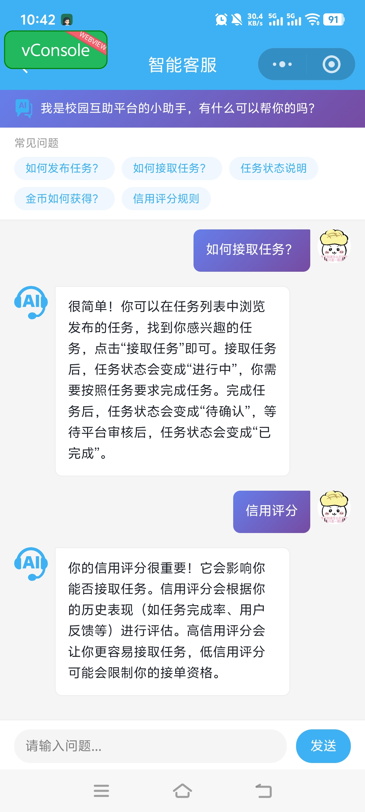

# 校园帮 - 校园互助平台

[](https://github.com/nykla23/Campus-Help/actions/workflows/ci.yml)
[](https://codecov.io/gh/nykla23/Campus-Help)
[](https://codecov.io/gh/nykla23/Campus-Help)
[](https://nodejs.org)
[](https://www.mysql.com)

---

## 📖 项目简介

**校园帮**是一个面向在校大学生的校园互助平台，旨在解决学生日常生活中的零散需求。用户可以在平台上发布取快递、带饭、借书、辅导功课等求助任务，也可以接单帮助他人完成任务赚取虚拟币。

项目核心功能涵盖：**用户注册登录、任务发布与接单、实时聊天沟通、任务完成确认、AI 智能客服**。通过虚拟币模拟交易，既避免了真实支付的复杂性，又能完整体现交易闭环。

> **Figma 设计稿：** [校园帮 UI 设计](https://www.figma.com/proto/Fo9HimWMMdRRbA6XvoMvqs/Campus-Help?node-id=2003-2735&t=Jty6wM9adEQb1E0T-1)

---

## 🧑‍💻 团队成员

| 姓名   | 学号       | 分工                                       |
| :----- | ---------- | ------------------------------------------ |
| 欧宝莲 | 2312190401 | 前端开发 + 后端开发 + 数据库设计 + UI 设计 |

---

## 🏗️ 技术栈

| 层级       | 技术                                                              |
| ---------- | ----------------------------------------------------------------- |
| **前端**   | 微信小程序原生开发（TypeScript + SCSS）                           |
| **后端**   | Node.js + Express（RESTful API）                                  |
| **数据库** | MySQL 8.0（支持事务）                                             |
| **认证**   | JWT（JSON Web Token）                                             |
| **实时通信** | Socket.IO（实时通知 + 在线状态）                                 |
| **AI 客服** | Cloudflare Workers AI（`@cf/meta/llama-3.1-8b-instruct`）        |
| **文件存储** | multer（头像上传，本地存储）                                      |
| **日志**   | Winston                                                          |
| **监控**   | Prometheus（/metrics 端点）                                       |
| **部署**   | Docker + Docker Compose / PM2（阿里云 ECS）                      |
| **CI/CD**  | GitHub Actions                                                    |

---

## ✨ 核心功能

### 1. 用户系统
- **注册**：用户名、昵称、密码、确认密码（JWT 自动签发）
- **登录**：用户名 + 密码验证，token 有效期 7 天
- **个人信息**：查看/修改昵称、个性签名、头像
- **修改密码**：验证旧密码后更新

### 2. 任务管理
- **发布任务**：选择类型（取件代送/跑腿代办/学习辅导/其他），填写标题、描述、悬赏币、地点、截止时间；发布时冻结虚拟币
- **任务列表**：分页加载，支持状态筛选、类型筛选、关键词搜索、排序（按时间/悬赏）
- **任务详情**：展示完整信息，含发布者/接单者资料卡片
- **接单**：将任务状态从"待接取"改为"进行中"
- **提交完成**：接单者提交完成，状态改为"待确认"
- **确认完成**：发布者确认，状态改为"已完成"，虚拟币划转至接单者
- **取消任务**：仅发布者可取消（待接取状态），返还虚拟币
- **放弃任务**：仅接单者可放弃（进行中状态），任务恢复为待接取

### 3. 消息系统
- **消息列表**：按「任务 + 对方用户」聚合，显示最新消息预览
- **聊天详情**：气泡式聊天布局，按时间升序显示
- **发送消息**：任务关联的双方用户互通，发送后通过轮询自动拉取新消息（3 秒间隔），接收方无需手动刷新即可看到

### 4. 虚拟币系统
- 发布任务时冻结悬赏币
- 确认完成后自动划转至接单者
- 取消/放弃任务后返还虚拟币
- 交易记录查询（收入/支出明细）

### 5. AI 智能客服
- 基于 Cloudflare Workers AI（Llama 3.1-8B）
- 支持自然语言问答，保留最近 10 轮对话上下文
- **后端代理调用**：前端发送请求至 `/api/ai/chat`，后端从 `.env` 读取 API Key 后调用 AI 服务，密钥不暴露给客户端
- 提供快捷问题入口

### 6. 实时消息拉取（轮询）
- 发送消息后，接收方在聊天页面每 3 秒自动拉取新消息，无需手动刷新
- 服务端已集成 Socket.IO 实时推送逻辑，前端通过轮询兜底保障消息可达

---

## 📁 项目目录结构

```
Campus-Help/
├── backend/                          # 后端 Express 项目
│   ├── app.js                        # 入口文件（路由挂载、中间件、Socket.IO）
│   ├── package.json
│   ├── .env.example                  # 环境变量模板
│   ├── Dockerfile                    # 生产 Dockerfile
│   ├── Dockerfile.dev                # 开发 Dockerfile
│   ├── jest.config.js
│   ├── config/
│   │   └── db.js                     # 数据库连接池配置
│   ├── constants.js                  # 全局常量（状态映射、错误码）
│   ├── controllers/                  # 业务逻辑控制器
│   │   ├── user.js                   # 用户注册/登录/个人信息
│   │   ├── task.js                   # 任务 CRUD
│   │   ├── publish.js                # 发布任务（含虚拟币冻结）
│   │   ├── message.js                # 消息系统
│   │   └── ai.js                     # AI 智能客服
│   ├── middleware/
│   │   ├── auth.js                   # JWT 认证中间件
│   │   └── metrics.js                # Prometheus 监控中间件
│   ├── models/                       # 数据模型
│   ├── routes/                       # 路由定义
│   │   ├── user.js                   # /api/users（注册、个人信息、头像）
│   │   ├── auth.js                   # /api/auth（登录）
│   │   ├── task.js                   # /api/tasks（任务 CRUD）
│   │   ├── message.js                # /api/messages（消息系统）
│   │   ├── ai.js                     # /api/ai（AI 客服）
│   │   └── health.js                 # 健康检查
│   ├── sql/
│   │   └── db_init.sql               # 数据库初始化 SQL
│   ├── tests/                        # 后端测试
│   ├── uploads/                      # 上传文件（头像）目录
│   └── utils/
│       └── logger.js                 # Winston 日志配置
│
├── frontend/                         # 微信小程序前端
│   ├── package.json
│   ├── project.config.json
│   ├── tsconfig.json
│   ├── babel.config.js
│   ├── Dockerfile
│   ├── miniprogram/
│   │   ├── app.json                  # 全局配置（页面路由、TabBar）
│   │   ├── app.ts                    # 全局入口
│   │   ├── app.scss                  # 全局样式
│   │   ├── app.wxss
│   │   ├── sitemap.json
│   │   ├── api/                      # API 调用封装
│   │   │   ├── task.ts
│   │   │   └── user.ts
│   │   ├── components/               # 公共组件
│   │   ├── config/
│   │   │   └── ai-config.js          # AI 客服配置
│   │   ├── images/                   # 图片资源
│   │   │   ├── tab/                  # TabBar 图标
│   │   │   ├── icon-*.png            # 功能图标
│   │   │   └── default-avatar.png
│   │   ├── pages/                    # 页面
│   │   │   ├── login/                # 登录页
│   │   │   ├── register/             # 注册页
│   │   │   ├── index/                # 首页（任务列表）
│   │   │   ├── publish/              # 发布任务页
│   │   │   ├── task/                 # 任务详情页
│   │   │   ├── message/              # 消息列表页
│   │   │   ├── chat/                 # 聊天详情页
│   │   │   ├── profile/              # 个人中心
│   │   │   ├── user-profile/         # 其他用户资料页
│   │   │   └── ai/                   # AI 智能客服页
│   │   ├── types/
│   │   │   └── global.d.ts
│   │   └── utils/                    # 工具模块
│   │       ├── api.ts                # 统一网络请求封装
│   │       ├── request.js
│   │       ├── common.ts             # 通用工具函数
│   │       └── config.js             # 后端 API 地址配置
│   └── __tests__/                    # 前端测试
│
├── docs/                             # 项目文档
│   ├── architecture.md               # 软件架构说明
│   ├── api.md                        # API 接口文档
│   ├── database.md                   # 数据库设计
│   ├── frontend.md                   # 前端开发说明
│   ├── backend.md                    # 后端开发说明
│   ├── deployment.md                 # 部署说明
│   ├── monitoring.md                 # 监控方案
│   ├── security-review.md            # 安全审查
│   ├── ai-feature.md                 # AI 客服功能说明
│   ├── 设计说明.md                   # UI 设计说明
│   ├── api.yaml                      # OpenAPI 规范
│   └── contributions/                # 各阶段贡献说明
│
├── compose.yaml                      # Docker Compose（开发环境）
├── compose.prod.yaml                 # Docker Compose（生产环境）
├── docker-compose.yml
├── deploy.sh                         # 部署脚本
├── .env.example                      # 环境变量模板
├── .gitignore
├── .coderabbit.yaml
├── eslint.config.js
├── package.json
└── package-lock.json
```

---

## 🚀 快速开始

### 环境要求

| 工具                 | 版本       |
| -------------------- | ---------- |
| Node.js              | 18+        |
| MySQL                | 8.0        |
| 微信开发者工具       | 最新稳定版 |
| npm                  | 9+         |

### 1. 克隆仓库

```bash
git clone https://github.com/nykla23/Campus-Help.git
cd Campus-Help
```

### 2. 后端启动

```bash
# 进入后端目录
cd backend

# 安装依赖
npm install

# 复制环境变量模板并编辑
cp .env.example .env
```

编辑 `.env` 文件，配置数据库连接和 JWT 密钥：

```env
DB_HOST=localhost
DB_PORT=3306
DB_USER=root
DB_PASSWORD=your_password
DB_NAME=campus_help
JWT_SECRET=your_jwt_secret
PORT=3000
```

```bash
# 导入数据库
mysql -u root -p < sql/db_init.sql

# 启动开发服务器（热重载）
npm run dev
```

后端服务将在 `http://localhost:3000` 启动。

### 3. 前端启动

```bash
# 回到项目根目录
cd ../frontend

# 安装依赖
npm install
```

使用 **微信开发者工具** 打开 `frontend` 文件夹，然后：

1. `project.config.json` 中已配置 AppID，可直接使用；如需更换为自有小程序，请在 [微信公众平台](https://mp.weixin.qq.com) 注册后修改 `project.config.json` 中的 `appid` 字段

2. 编辑 `miniprogram/utils/config.js`，配置后端 API 地址和 WebSocket 地址：
   - `SERVER_HOST`：HTTP API 地址
   - `WS_HOST`：由 `SERVER_HOST` 自动推导（`http://` → `ws://`），无需手动填写

```javascript
module.exports = {
  SERVER_HOST: 'http://127.0.0.1:3000',
  get WS_HOST() { return this.SERVER_HOST.replace(/^http/, 'ws'); },
  get API_BASE_URL() { return `${this.SERVER_HOST}/api`; },
};
```

3. 在微信开发者工具中点击「工具 → 构建 npm」，确保 npm 依赖正确引入

4. 点击「编译」运行

### 4. 使用 Docker 部署（可选）

`compose.yaml`（开发环境）和 `compose.prod.yaml`（生产环境）均已配置：

- `docker compose up -d` **会自动构建镜像**，无需手动 `docker build`
- 开发环境的 `compose.yaml` **已内置环境变量**（`JWT_SECRET`、数据库连接等），不依赖外部 `.env` 文件
- DB 容器通过 `healthcheck` 确保数据库就绪后才启动后端

```bash
# 开发环境（默认 compose.yaml）
docker compose up -d

# 生产环境
docker compose -f compose.prod.yaml up -d

# 查看日志
docker compose logs -f
```

---

## 📡 API 接口概览

> 基础 URL：`http://localhost:3000/api`  
> 认证方式：除注册/登录外，所有接口需在请求头携带 `Authorization: Bearer <token>`

### 用户模块

| 方法 | 端点                              | 说明                 | 认证 |
| ---- | --------------------------------- | -------------------- | ---- |
| POST | `/api/users`                      | 用户注册             | 否   |
| POST | `/api/auth/login`                 | 用户登录             | 否   |
| GET  | `/api/users/profile`              | 获取个人信息         | 是   |
| POST | `/api/users/update`               | 修改昵称/个性签名    | 是   |
| POST | `/api/users/change-password`      | 修改密码             | 是   |
| POST | `/api/users/upload-avatar`        | 上传头像             | 是   |
| GET  | `/api/users/tasks/publish`        | 我发布的任务列表     | 是   |
| GET  | `/api/users/tasks/receive`        | 我接单的任务列表     | 是   |
| GET  | `/api/users/trades`               | 交易记录             | 是   |
| GET  | `/api/users/avatar/:userId`       | 获取用户头像         | 否   |
| GET  | `/api/users/:id`                  | 查看其他用户公开信息 | 是   |
| GET  | `/api/users/:id/tasks`            | 查看其他用户发布的任务 | 是   |

### 任务模块

| 方法 | 端点                           | 说明               | 认证 |
| ---- | ------------------------------ | ------------------ | ---- |
| GET  | `/api/tasks`                   | 任务列表（分页）   | 是   |
| POST | `/api/tasks`                   | 发布任务           | 是   |
| GET  | `/api/tasks/:id`               | 任务详情           | 是   |
| POST | `/api/tasks/:id/accept`        | 接单               | 是   |
| POST | `/api/tasks/:id/complete`      | 接单者提交完成     | 是   |
| POST | `/api/tasks/:id/confirm`       | 发布者确认完成     | 是   |
| POST | `/api/tasks/:id/cancel`        | 取消任务           | 是   |
| POST | `/api/tasks/:id/giveup`        | 放弃任务           | 是   |

### 消息模块

| 方法 | 端点                                      | 说明             | 认证 |
| ---- | ----------------------------------------- | ---------------- | ---- |
| GET  | `/api/messages/list`                      | 消息列表         | 是   |
| GET  | `/api/messages/chat/:taskId/:targetId`    | 聊天详情         | 是   |
| POST | `/api/messages/send`                      | 发送消息         | 是   |

### 其他

| 方法 | 端点          | 说明                 | 认证 |
| ---- | ------------- | -------------------- | ---- |
| POST | `/api/ai/chat` | AI 智能客服对话      | 是   |
| GET  | `/health`     | 健康检查             | 否   |
| GET  | `/metrics`    | Prometheus 监控指标   | 否   |

### 通用响应格式

```json
{
  "code": 0,
  "data": {},
  "message": "success"
}
```

### 主要错误码

| 状态码 | 含义                           |
| ------ | ------------------------------ |
| 0      | 成功                           |
| 1001   | 参数错误                       |
| 1004   | 用户名已存在                   |
| 1005   | 用户不存在或密码错误           |
| 1007   | 两次密码不一致                 |
| 2001   | 任务不存在                     |
| 2002   | 任务状态不允许当前操作         |
| 2003   | 任务已被接单                   |
| 2004   | 不能操作自己发布的任务         |
| 2005   | 余额不足                       |
| 5000   | 服务器内部错误                 |

---

## 🗄️ 数据库设计

共包含 **4 张表**（users、tasks、transactions、messages）：

### 用户表（users）

| 字段         | 类型         | 说明                          |
| ------------ | ------------ | ----------------------------- |
| id           | INT          | 主键，自增                    |
| username     | VARCHAR(50)  | 用户名（唯一）                |
| password     | VARCHAR(255) | bcrypt 加密密码               |
| nickname     | VARCHAR(50)  | 昵称                          |
| avatar       | VARCHAR(255) | 头像 URL                      |
| signature    | VARCHAR(200) | 个性签名                      |
| credit_score | INT          | 信用分（默认 100）            |
| coins        | INT          | 虚拟币余额（默认 100）        |
| created_at   | DATETIME     | 注册时间                      |
| updated_at   | DATETIME     | 更新时间                      |

### 任务表（tasks）

| 字段         | 类型         | 说明                                           |
| ------------ | ------------ | ---------------------------------------------- |
| id           | INT          | 主键，自增                                     |
| publisher_id | INT          | 发布者 ID                                      |
| acceptor_id  | INT          | 接单者 ID                                      |
| title        | VARCHAR(100) | 任务标题                                       |
| description  | TEXT         | 详细描述                                       |
| reward       | INT          | 悬赏虚拟币                                     |
| location     | VARCHAR(100) | 地点                                           |
| type         | TINYINT      | 0-全部 1-取件代送 2-跑腿代办 3-学习辅导 4-其他 |
| status       | TINYINT      | 0-待接取 1-进行中 2-待确认 3-已完成 4-已取消   |
| deadline     | DATETIME     | 截止时间                                       |
| created_at   | DATETIME     | 发布时间                                       |
| updated_at   | DATETIME     | 更新时间                                       |

### 消息表（messages）

| 字段       | 类型     | 说明             |
| ---------- | -------- | ---------------- |
| id         | INT      | 主键，自增       |
| from_id    | INT      | 发送者 ID        |
| to_id      | INT      | 接收者 ID        |
| task_id    | INT      | 关联任务 ID      |
| content    | TEXT     | 消息内容         |
| created_at | DATETIME | 消息发送时间     |

### 交易记录表（transactions）

| 字段        | 类型         | 说明                           |
| ----------- | ------------ | ------------------------------ |
| id          | INT          | 主键，自增                     |
| user_id     | INT          | 用户 ID                        |
| type        | TINYINT      | 1-收入 2-支出 3-冻结 4-解冻    |
| amount      | INT          | 金额                           |
| balance     | INT          | 交易后余额                     |
| task_id     | INT          | 关联任务 ID                    |
| description | VARCHAR(255) | 描述                           |
| created_at  | DATETIME     | 交易时间                       |


### ER 图



> 完整建表 SQL 见 `backend/sql/db_init.sql`

---

## 🤝 贡献指南

本项目采用 **Git Flow** 分支管理策略：

1. 在 `develop` 分支上进行日常开发
2. 功能完成后，创建 Pull Request 从 `develop` 合并到 `main`
3. `main` 分支始终保持稳定可部署状态

### 代码规范

- **后端**：遵循 RESTful 设计规范，统一响应格式 `{ code, data, message }`
- **前端**：使用 TypeScript，全局样式变量统一管理
- **提交信息**：遵循 [Conventional Commits](https://www.conventionalcommits.org/) 规范

---

## 📸 截图


| 页面         | 预览                               |
| ------------ | ---------------------------------- |
| 登录/注册页  |   |
| 首页任务列表 |    |
| 发布任务页   |  |
| 任务详情页   |    |
| 消息/聊天页  |    |
| 个人中心     |  |
| AI 智能客服  |      |

---

## 🧪 测试

```bash
# 后端测试
cd backend
npm test

# 前端测试
cd frontend
npm test
```

---

## 📦 部署

### 阿里云 ECS 部署

后端已部署至阿里云 ECS（Ubuntu 22.04），使用 pm2 进程管理：

- 在线地址：`http://112.124.21.214:3000/health`
- 进程管理：pm2（已配置开机自启）
- 部署方式：手动 SSH + scp 上传代码或 GitHub Actions 自动部署

### Docker 部署

```bash
# 开发环境（默认 compose.yaml）
docker compose up -d

# 生产环境
docker compose -f compose.prod.yaml up -d

# 查看日志
docker compose logs -f
```

### 手动部署

1. 后端：`cd backend && npm start`
2. 前端：使用微信开发者工具上传代码至微信小程序平台

> 详细部署说明见 `docs/deployment.md`

---

## 📊 监控

- **结构化日志**：使用 Winston 输出 JSON 格式日志（时间戳、级别、消息、模块）
- **健康检查**：`GET /health` 返回服务状态和数据库连接状态
- **Prometheus 指标**：`GET /metrics` 暴露请求计数、响应时间、错误率、活跃用户数

> 详细监控方案见 `docs/monitoring.md`

---

## 📝 设计决策与说明

- **消息系统**：基于自建 Web API（MySQL 存储消息）+ Socket.IO 实时通知实现。采用自建方案而非第三方 IM SDK，可完全控制数据、零外部依赖、无需额外付费
- **AI 智能客服**：采用后端代理调用方案，前端发送请求至 `/api/ai/chat`，后端从 `.env` 读取 Cloudflare Workers AI API Key 后调用 AI 服务。敏感凭证完全存储在服务端，不暴露给客户端
- **虚拟币事务一致性**：所有涉及余额变更的操作（发布冻结、确认划转、取消返还）均使用 MySQL 事务（`beginTransaction`/`commit`/`rollback`）包装，余额扣减采用原子 SQL（`UPDATE users SET coins = coins ± ? WHERE coins >= ?`），通过 `affectedRows` 判断是否扣减成功，避免并发竞态条件
- **头像存储方案**：使用 Docker 命名卷（`backend_uploads_dev`）持久化头像文件到宿主机，容器重启不丢失。如需水平扩展多实例，后续可迁移至对象存储（OSS/S3）
- **信用分字段**：`credit_score` 字段设计用于任务完成后的互评体系，评价会影响双方信用分。当前评价功能未实现，信用分仅在个人主页展示（默认值 100），未与业务逻辑绑定
- **MySQL 部署**：阿里云 ECS 部署时本地数据库已成功迁移至云服务器 Docker 内的 MySQL 容器，云服务器中已包含完整本地数据

---

## 📋 已知限制与后续规划

以下功能当前未实现，属于已知不足或后续可改进的方向：

- **消息已读/未读**：`messages` 表未设计 `is_read` 字段，用户无法区分已读和未读消息。后续可在表中加 `is_read` 字段，进入聊天页时批量标记为已读
- **deadline 超时自动处理**：任务表有 `deadline` 字段，但系统无后台定时任务自动处理过期任务。后续可用 `node-cron` 定期扫描并自动取消超时任务、返还虚拟币
- **JWT 撤销机制**：当前无 refresh token 或 token 黑名单机制，token 泄露后 7 天内无法撤销，修改密码后旧 token 仍然有效。后续可引入 `token_version` 机制或黑名单表
- **并发测试**：涉及虚拟币的核心操作未编写专门的并发和边界测试，后续可补充
