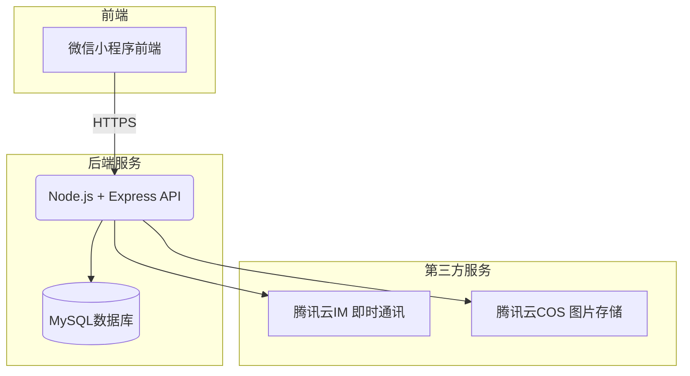
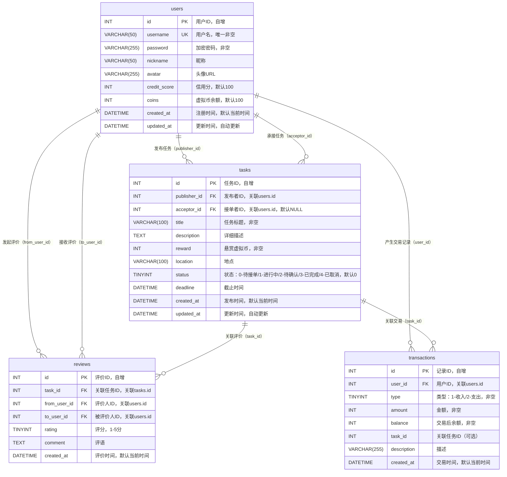

# 软件架构设计文档

## 1. 系统架构图

## 技术选型确认

| 层级 | 选择 | 理由 |
| :----------- | :----------------- | :----------------------------------------------------------- |
| **前端框架** |  VS Code 编写代码 + 微信开发者工具实时预览 / 调试；WXML + WXSS(SCSS) + TypeScript | VS Code 拥有强大的代码提示、格式化、语法校验能力，大幅提升小程序 .wxml / .scss / .ts 编写效率；微信开发者工具提供原生小程序模拟器、真机调试、预览发布能力，是小程序开发官方标准环境；两者联动实现代码实时热更新，保存即刷新，开发体验流畅。 |
| **后端框架** | Node.js + Express  | 轻量、灵活，JavaScript 全栈统一语言，社区活跃，适合快速开发 RESTful API。 |
| **数据库**   | MySQL 8.0+         | 关系型数据库，支持事务，保证虚拟币交易的一致性，数据结构化强。 |
| **部署方式** | 本地服务器（开发） | 以本地开发为主，降低成本。                                   |
## 前端架构（页面/组件结构）

### 3.1 页面结构

1. **登录/注册页**：用户认证入口。
2. **首页**：展示任务列表，支持筛选和搜索。
3. **任务详情页**：展示完整任务信息，可私聊发布者。
4. **发布任务页**：表单填写任务信息，提交前校验余额。
5. **聊天页**：集成腾讯云 IM，实现实时沟通。
6. **个人中心页**：展示用户信息、信用分、虚拟币余额，以及“我发布的”、“我接单的”等入口。

### 3.2 组件划分

**底部导航栏**：在首页、消息页、个人中心页复用。

**任务卡片组件**：在首页和“我发布的”和“我接单的”复用。

**评分组件**：显示星级和评价数。

**头像组件**：支持默认头像和加载失败占位。

### 3.3 状态管理

 使用小程序全局数据 `App.globalData` 存储用户信息和 token。

 使用本地缓存 `wx.setStorageSync` 持久化 token 和用户信息。

## 后端架构（服务/模块划分）

### 4.1 模块划分

- **用户模块**：注册、登录、个人信息管理、密码修改。
- **任务模块**：发布、浏览、接单、完成、取消任务。
- **评价模块**：提交评价、查询评价。
- **虚拟币模块**：余额查询、交易记录。

### 4.2 中间件

- **认证中间件**：验证 JWT，解析用户信息挂载到 `req.user`。
- **错误处理中间件**：统一捕获异常，返回标准错误格式。
- **参数校验中间件**：使用 `express-validator` 或自定义校验。

### 4.3 路由设计

- `POST /api/users/register` - 注册
- `POST /api/users/login` - 登录
- `GET /api/users/profile` - 获取个人信息
- `PUT /api/users/profile` - 更新个人信息
- `PUT /api/users/password` - 修改密码
- `POST /api/tasks` - 发布任务
- `GET /api/tasks` - 获取任务列表
- `GET /api/tasks/:id` - 获取任务详情
- `POST /api/tasks/:id/accept` - 接单
- `POST /api/tasks/:id/complete` - 确认完成
- `POST /api/tasks/:id/cancel` - 取消任务
- `POST /api/reviews` - 提交评价
- `GET /api/reviews?userId=xxx` - 获取用户收到的评价
- `GET /api/coins/transactions` - 获取交易记录

## 5. 数据库设计概要

主要包含三个核心表：`users`（用户）、`tasks`（任务）、`reviews`（评价）、`transactions`（交易记录表）。详细设计见 `database.md`。

### ER 图

## 6. 系统交互流程

以“发布任务 → 接单 → 完成 → 评价”为例：

1. **用户登录**：前端调用登录接口，获取 JWT token 并存储。
2. **发布任务**：用户填写任务信息，点击发布，前端 POST `/api/tasks`，携带 token。后端验证用户余额，冻结相应虚拟币，插入任务记录，返回 taskId。
3. **浏览任务**：首页 GET `/api/tasks` 获取任务列表，展示任务卡片。
4. **接单**：用户点击任务卡片进入详情页，点击“接单”，前端 POST `/api/tasks/:id/accept`，携带 token。后端更新任务状态为“进行中”，记录接单者 ID。
5. **沟通**：双方通过聊天页面沟通（腾讯云 IM）。
6. **确认完成**：发布者确认任务已完成，前端 POST `/api/tasks/:id/complete`，后端使用事务将冻结的虚拟币划转给接单者，更新任务状态为“已完成”。
7. **评价**：任务完成后，双方进入评价页面提交评价，前端 POST `/api/reviews`，后端更新信用分。

    

# 校园帮 - 数据库设计文档

## 1. ER 图

