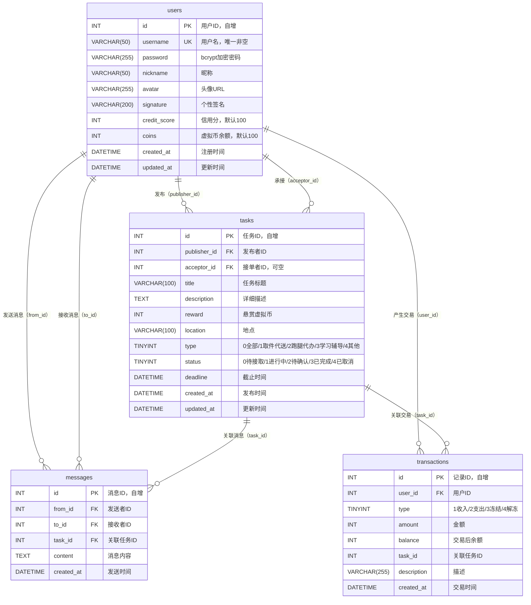

# 校园帮 — 项目报告

---

## 一、项目背景与目标

### 1.1 项目简介

校园帮是一个面向在校大学生的校园互助平台，旨在解决学生日常生活中的零散需求。目标用户为校内学生，他们可以在平台上发布取快递、带饭、借书、辅导功课等求助任务，也可以接单帮助他人完成任务赚取虚拟币。

### 1.2 所要解决的问题

在当前校园环境中，学生在日常学习生活中常有大量零散需求无法快速找到愿意帮忙的同伴。现有解决方案多为班级群、年级群等非结构化信息发布，存在以下问题：

- **信息杂乱**：需求与闲聊混杂，难以快速筛选；
- **匹配低效**：缺乏任务状态跟踪机制，无法追溯任务进度；
- **信任缺失**：缺乏信用评价体系，难以评估对方的可靠性；
- **缺乏闭环**：缺少从发布到确认完成的完整流程管理。

### 1.3 项目目标

构建一个面向在校大学生的校园互助平台，以微信小程序为前端载体，后端提供完整的 RESTful API 服务。项目核心目标包括：

1. 实现任务的完整生命周期管理（发布 → 接单 → 完成 → 确认）；
2. 提供实时聊天沟通渠道，促进任务双方高效协作；
3. 集成 AI 智能客服，辅助用户操作；
4. 保证虚拟币交易的事务一致性与数据安全。

### 1.4 开发流程

项目按照课程安排的节奏持续推进：

| 阶段 | 主要工作 |
|:---|:---|
| Week 0 | 团队组建、选题确定 |
| Week 1 | Git 版本控制配置、Git Flow 分支策略 |
| Week 2 | UI/UX 设计（Figma 原型） |
| Week 3 | 系统架构设计、模块划分 |
| Week 4 | API 接口设计 |
| Week 5 | 前端开发（页面与组件） |
| Week 6 | 后端开发（控制器与路由） |
| Week 7 | AI 功能集成 |
| Week 8 | 单元测试与集成测试编写 |
| Week 9 | CI/CD 配置（GitHub Actions） |
| Week 10 | 安全审查（JWT、密码加密、凭证管理） |
| Week 11 | 部署方案设计与实施 |
| Week 12 | 云服务配置（阿里云 ECS + Docker） |
| Week 13 | 监控方案（日志、健康检查、Prometheus） |
| Week 14 | 交付与文档整理 |

---

## 二、需求分析

### 2.1 功能需求列表

系统围绕任务的生命周期涉及两种角色：发布求助任务的**发布者**（Publisher）和提供帮助的**接单者**（Acceptor）。同一用户可在不同任务中分别担任这两种角色（但不能接自己发布的任务）。系统按模块划分为以下五大功能域：

#### 用户模块

| 编号 | 功能名称 | 描述 |
|:---|:---|:---|
| U-01 | 用户注册 | 提供用户名、昵称、密码、确认密码进行注册，注册成功自动签发 JWT |
| U-02 | 用户登录 | 通过用户名 + 密码验证登录，token 有效期 7 天 |
| U-03 | 查看个人信息 | 获取昵称、个性签名、头像、虚拟币余额、信用分等信息 |
| U-04 | 修改个人信息 | 修改昵称、个性签名 |
| U-05 | 修改密码 | 验证旧密码后更新为新密码 |
| U-06 | 上传头像 | 支持上传头像文件（本地存储） |
| U-07 | 查看他人公开信息 | 查看其他用户的昵称、信用分等公开信息及其发布的任务列表 |

#### 任务管理模块

| 编号 | 功能名称 | 描述 |
|:---|:---|:---|
| T-01 | 发布任务 | 选择类型（取件代送/跑腿代办/学习辅导/其他），填写标题、描述、悬赏币、地点、截止时间；发布时冻结虚拟币 |
| T-02 | 任务列表 | 分页加载，支持按状态筛选、类型筛选、关键词搜索、排序（按时间/悬赏） |
| T-03 | 任务详情 | 展示完整信息，含发布者/接单者资料卡片 |
| T-04 | 接单 | 将任务状态从"待接取"改为"进行中" |
| T-05 | 提交完成 | 接单者提交完成，状态改为"待确认" |
| T-06 | 确认完成 | 发布者确认，状态改为"已完成"，虚拟币划转至接单者 |
| T-07 | 取消任务 | 仅发布者可取消（待接取状态），返还虚拟币 |
| T-08 | 放弃任务 | 仅接单者可放弃（进行中状态），任务恢复为待接取 |

#### 消息模块

| 编号 | 功能名称 | 描述 |
|:---|:---|:---|
| M-01 | 消息列表 | 按"任务 + 对方用户"聚合，显示最新消息预览 |
| M-02 | 聊天详情 | 气泡式聊天布局，按时间升序显示 |
| M-03 | 发送消息 | 任务关联的双方用户互通，发送后通过轮询自动拉取新消息 |

#### 虚拟币模块

| 编号 | 功能名称 | 描述 |
|:---|:---|:---|
| B-01 | 余额冻结 | 发布任务时冻结悬赏币 |
| B-02 | 余额划转 | 确认完成后自动划转至接单者 |
| B-03 | 余额返还 | 取消/放弃任务后返还虚拟币 |
| B-04 | 交易记录 | 查询收入/支出/冻结/解冻明细 |

#### AI 客服模块

| 编号 | 功能名称 | 描述 |
|:---|:---|:---|
| A-01 | 智能对话 | 支持自然语言问答，保留最近对话上下文 |
| A-02 | 快捷问题 | 提供 5 个常用快捷问题入口 |
| A-03 | 平台知识库 | AI 具备发布任务、接单流程、金币规则等平台操作指南 |

### 2.3 非功能需求

| 类别 | 具体要求 |
|:---|:---|
| **一致性** | 虚拟币余额变更操作均使用 MySQL 事务包装，余额扣减采用原子 SQL，通过 `affectedRows` 判断是否扣减成功，避免并发竞态条件 |
| **安全性** | 密码使用 bcrypt 加密存储；JWT 进行身份认证；AI API Key 仅存储在服务端 `.env` 文件中，不暴露给前端 |
| **实时性** | 消息系统采用 Socket.IO 实时推送 + 3 秒轮询兜底的双重保障机制，确保消息可达 |
| **可维护性** | 统一响应格式 `{ code, data, message }`，结构化 Winston 日志，Prometheus 监控指标 |
| **可部署性** | 支持 Docker Compose 一键部署，开发/生产环境配置文件分离 |

---

## 三、技术选型

### 3.1 技术栈总览

| 层级 | 选用技术 | 版本 |
|:---|:---|:---:|
| 前端框架 | 微信小程序原生开发（TypeScript + SCSS） | — |
| 后端框架 | Node.js + Express | 5.2.1 |
| 数据库 | MySQL | 8.0 |
| 身份认证 | JWT（jsonwebtoken） | 9.0.3 |
| 实时通信 | Socket.IO | 4.8.3 |
| AI 客服 | Cloudflare Workers AI（Llama 3.1-8B） | — |
| 文件存储 | multer（本地存储） | 2.1.1 |
| 日志 | Winston | 3.19.0 |
| 监控 | Prometheus（prom-client） | 15.1.3 |
| 部署 | Docker + Docker Compose / PM2（阿里云 ECS） | — |
| CI/CD | GitHub Actions | — |

### 3.2 各技术选型理由

**前端：微信小程序原生开发（TypeScript + SCSS）**

选择微信小程序而非其他跨平台框架（如 React Native、Flutter），主要基于以下考虑：

- **平台适配**：目标用户为在校大学生，微信是国内大学生日常使用频率最高的应用之一，小程序无需额外安装应用，即开即用；
- **原生开发优势**：原生框架与微信生态深度集成，可无缝使用微信的登录、支付、文件下载等原生能力；
- **TypeScript 保障**：引入类型系统提升代码可维护性，降低运行时错误；
- **VS Code + 微信开发者工具联动**：利用 VS Code 强大的代码编辑能力（语法提示、格式化、TypeScript 检查），配合微信开发者工具的真机调试和预览能力，实现高效的开发体验。

**后端：Node.js + Express**

- **语言统一**：前后端均使用 JavaScript/TypeScript，降低上下文切换成本；
- **生态丰富**：npm 拥有庞大的开源包生态，可快速集成 JWT、WebSocket、数据库驱动等；
- **轻量灵活**：Express 作为最成熟的 Node.js 框架之一，路由和中间件机制简洁直观，适合中小型 RESTful API 开发；
- **对比备选**：相比 Spring Boot（Java），Node.js 在快速原型开发和小型项目上启动更快、配置更轻；相比 Flask（Python），Node.js 的事件驱动模型更适合 I/O 密集型的聊天和实时通信场景。

**数据库：MySQL 8.0**

- **事务支持**：InnoDB 引擎完整支持 ACID 事务，是保证虚拟币交易一致性的基础；
- **数据结构化**：任务、用户、消息等核心实体间的关系明确，关系型数据库能够自然表达；
- **对比备选**：相比 MongoDB 等 NoSQL 数据库，MySQL 在事务性要求高的场景下具有明显优势；相比 PostgreSQL，MySQL 在 Windows 和云服务器（阿里云）上的部署和维护成本更低。

**实时通信：Socket.IO + 前端轮询**

- **Socket.IO**：提供 WebSocket 实时推送能力，用于通知在线用户新消息到达；
- **前端轮询兜底**：3 秒间隔自动拉取新消息，确保在网络环境不稳定的情况下消息不丢失；
- **自建方案而非第三方 IM SDK**（如腾讯云 IM、环信）：可完全控制数据所有权、零外部依赖、无需额外付费。

**AI 客服：Cloudflare Workers AI（llama-3.2-3b-instruct）**

- **免费额度充足**：Cloudflare Workers AI 提供慷慨的免费额度，适合课程项目；
- **国内可访问**：相比 Groq API 国内访问受限，Cloudflare 在国内有较好的网络连通性；
- **模型能力**：llama-3.2-3b-instruct 模型具有良好的自然语言理解能力，能够准确理解平台相关的操作问题。

### 3.3 关键技术决策

**后端代理调用 AI**：前端发送请求至 `/api/ai/chat`，后端从 `.env` 读取 Cloudflare API Key 后调用 AI 服务。敏感凭证完全存储在服务端，不暴露给客户端，避免 API Key 泄露风险。

**头像三级缓存策略**：前端加载用户头像时，采用"内存 → Storage → 下载"三级缓存机制，支持批量预加载。后端提供 `/api/user/avatar/:userId` 接口返回 base64 作为兜底方案，同时 Docker 命名卷持久化存储头像文件。

**消息系统自建方案**：基于自建 Web API（MySQL 存储消息）+ Socket.IO 实时通知实现，而非采用第三方 IM SDK，可完全控制数据、零外部依赖、无需额外付费。

---

## 四、系统设计

### 4.1 系统架构图

```
┌─────────────────────────────────────────────────────────────────────┐
│                        用户端（微信小程序）                           │
│  ┌───────┐ ┌───────┐ ┌───────┐ ┌───────┐ ┌───────┐ ┌───────┐        │
│  │ 登录/  │ │ 首页- │ │ 发布  │ │ 任务  │ │ 消息/ │ │ AI   │          │
│  │ 注册页 │ │ 任务  │ │ 任务页│ │ 详情页│ │ 聊天页│ │ 客服页│          │
│  └───────┘ └───────┘ └───────┘ └───────┘ └───────┘ └───────┘        │
│         ┌─────────────────────────────────────────────┐             │
│         │      utils: api.ts / common.ts / config.js   │            │
│         └─────────────────────────────────────────────┘             │
└─────────────────────────────┬───────────────────────────────────────┘
                              │ HTTP / WebSocket
                              ▼
┌─────────────────────────────────────────────────────────────────────┐
│                    Node.js + Express 后端服务                        │
│                                                                     │
│  ┌────────────┐  ┌──────────┐  ┌──────────────────────────────┐     │
│  │  路由层    │  │ 中间件层  │  │      控制器层（Controllers） │     │
│  │ /api/*     │→ │ JWT 认证 │→ │ user.js  task.js publish.js │     │
│  │ /health    │  │ 监控指标  │  │ message.js  ai.js           │     │
│  │ /metrics   │  └──────────┘  └──────────────────────────────┘     │
│  └────────────┘                                                       │
│         │                                                            │
│         ▼                                                            │
│  ┌────────────┐  ┌────────────┐  ┌──────────────────────────────┐   │
│  │  MySQL 8.0 │  │ Socket.IO  │  │ Cloudflare Workers AI (LLM) │   │
│  │  (事务)    │  │ (实时推送)  │  │ (后端代理调用)               │   │
│  └────────────┘  └────────────┘  └──────────────────────────────┘   │
│                                                                       │
│  ┌──────────┐  ┌────────────┐  ┌────────────────────────────────┐   │
│  │ Winston  │  │ Prometheus│  │        multer 文件存储           │   │
│  │ 日志     │  │ 监控      │  │        /uploads/avatars/        │   │
│  └──────────┘  └────────────┘  └────────────────────────────────┘   │
└─────────────────────────────────────────────────────────────────────┘
                              │
                              ▼
┌─────────────────────────────────────────────────────────────────────┐
│                       部署与运维                                       │
│  ┌──────────────────────┐  ┌──────────────────────────────────┐    │
│  │ 阿里云 ECS Ubuntu    │  │ Docker + Docker Compose          │    │
│  │ PM2 进程管理 + 开机自启│  │ compose.yaml / compose.prod.yaml│    │
│  └──────────────────────┘  └──────────────────────────────────┘    │
│  ┌──────────────────────────────────────────────────────────────┐   │
│  │            CI/CD: GitHub Actions + Codecov                     │   │
│  └──────────────────────────────────────────────────────────────┘   │
└─────────────────────────────────────────────────────────────────────┘
```

### 4.2 模块划分

#### 前端页面模块

| 页面 | 路由 | 功能描述 |
|:---|:---|:---|
| 登录页 | `pages/login` | 用户登录入口 |
| 注册页 | `pages/register` | 新用户注册 |
| 首页 | `pages/index` | 任务列表、筛选搜索、AI 客服悬浮按钮 |
| 发布任务页 | `pages/publish` | 表单填写任务信息，提交前校验余额 |
| 任务详情页 | `pages/task` | 展示完整任务信息、操作按钮 |
| 消息列表页 | `pages/message` | 按任务+对方用户聚合的消息列表 |
| 聊天详情页 | `pages/chat` | 气泡式聊天、消息拉取 |
| 个人中心 | `pages/profile` | 个人资料、发布的/接单的任务、交易记录 |
| 他人资料页 | `pages/user-profile` | 查看其他用户信息 |
| AI 客服页 | `pages/ai` | AI 智能对话 |

#### 后端功能模块

| 模块 | 控制器 | 路由 |
|:---|:---|:---|
| 用户模块 | `controllers/user.js` | `routes/user.js`, `routes/auth.js` |
| 任务模块 | `controllers/task.js` | `routes/task.js` |
| 发布模块 | `controllers/publish.js` | 挂载在任务路由下 |
| 消息模块 | `controllers/message.js` | `routes/message.js` |
| AI 模块 | `controllers/ai.js` | `routes/ai.js` |
| 健康检查 | routes/health.js（路由内联实现） | `routes/health.js` |

#### 中间件

| 中间件 | 功能 |
|:---|:---|
| `middleware/auth.js` | JWT 验证，解析用户信息挂载到 `req.user` |
| `middleware/metrics.js` | Prometheus 监控指标采集（请求计数、响应时间、错误率、活跃用户数） |

### 4.3 数据库设计

#### ER 图



#### 表结构说明

系统共包含 4 张核心数据表：

**用户表（users）**：存储用户身份信息及虚拟资产。密码使用 bcrypt 加密存储。`coins` 字段记录虚拟币余额（默认 100），`credit_score` 字段设计用于未来评价体系（当前默认 100，仅展示）。

**任务表（tasks）**：记录任务的完整生命周期。`publisher_id` 和 `acceptor_id` 分别关联用户表，`status` 字段标记任务当前状态（0-待接取、1-进行中、2-待确认、3-已完成、4-已取消），`type` 字段标记任务分类。建有 `status`、`type`、`created_at` 索引以优化列表查询。

**消息表（messages）**：记录用户间的聊天消息。每一条消息记录发送者、接收者、关联任务和内容，按时间排序展示。

**交易记录表（transactions）**：记录虚拟币的所有变动明细。`type` 字段区分收入、支出、冻结、解冻四种类型，`balance` 记录交易后的余额快照，支持用户查询完整的资金流水。建有 `(user_id, created_at)` 复合索引。

### 4.4 API 接口设计

#### 设计规范

- **基础 URL**：`http://localhost:3000/api`
- **认证方式**：除注册和登录外，所有接口需在请求头携带 `Authorization: Bearer <token>`
- **统一响应格式**：

```json
{
  "code": 0,
  "data": {},
  "message": "success"
}
```

- **错误码定义**：

| 错误码 | 含义 |
|:---|:---|
| 0 | 成功 |
| 1001 | 参数错误 |
| 1004 | 用户名已存在 |
| 1005 | 用户不存在或密码错误 |
| 1007 | 两次密码不一致 |
| 2001 | 任务不存在 |
| 2002 | 任务状态不允许当前操作 |
| 2003 | 任务已被接单 |
| 2004 | 不能操作自己发布的任务 |
| 2005 | 余额不足 |
| 5000 | 服务器内部错误 |

#### 主要接口列表

**用户模块**

| 方法 | 端点 | 说明 | 认证 |
|:---|:---|:---|:---:|
| POST | `/api/users` | 用户注册 | 否 |
| POST | `/api/auth/login` | 用户登录 | 否 |
| GET | `/api/users/profile` | 获取个人信息 | 是 |
| POST | `/api/users/update` | 修改昵称/个性签名 | 是 |
| POST | `/api/users/change-password` | 修改密码 | 是 |
| POST | `/api/users/upload-avatar` | 上传头像 | 是 |
| GET | `/api/users/tasks/publish` | 我发布的任务列表 | 是 |
| GET | `/api/users/tasks/receive` | 我接单的任务列表 | 是 |
| GET | `/api/users/trades` | 交易记录 | 是 |
| GET | `/api/users/avatar/:userId` | 获取用户头像 | 否 |
| GET | `/api/users/:id` | 查看其他用户公开信息 | 是 |
| GET | `/api/users/:id/tasks` | 查看其他用户发布的任务 | 是 |

**任务模块**

| 方法 | 端点 | 说明 | 认证 |
|:---|:---|:---|:---:|
| GET | `/api/tasks` | 任务列表（分页） | 是 |
| POST | `/api/tasks` | 发布任务 | 是 |
| GET | `/api/tasks/:id` | 任务详情 | 是 |
| POST | `/api/tasks/:id/accept` | 接单 | 是 |
| POST | `/api/tasks/:id/complete` | 接单者提交完成 | 是 |
| POST | `/api/tasks/:id/confirm` | 发布者确认完成 | 是 |
| POST | `/api/tasks/:id/cancel` | 取消任务 | 是 |
| POST | `/api/tasks/:id/giveup` | 放弃任务 | 是 |

**消息模块**

| 方法 | 端点 | 说明 | 认证 |
|:---|:---|:---|:---:|
| GET | `/api/messages/list` | 消息列表 | 是 |
| GET | `/api/messages/chat/:taskId/:targetId` | 聊天详情 | 是 |
| POST | `/api/messages/send` | 发送消息 | 是 |

**其他**

| 方法 | 端点 | 说明 | 认证 |
|:---|:---|:---|:---:|
| POST | `/api/ai/chat` | AI 智能客服对话 | 是 |
| GET | `/health` | 健康检查 | 否 |
| GET | `/metrics` | Prometheus 监控指标 | 否 |

---

## 五、核心功能实现

### 5.1 虚拟币交易一致性

#### 实现思路

虚拟币是平台的核心经济激励手段，涉及"发布冻结→确认划转→取消返还"的资金流转闭环。保证这些操作在高并发场景下的数据一致性是系统最重要的技术挑战之一。

设计方案采用"**MySQL 事务 + 原子 SQL 扣减**"的双重保障策略：

1. **事务包装**：每个涉及余额变更的操作均使用 `beginTransaction` / `commit` / `rollback` 包围；
2. **原子扣减**：用 `UPDATE users SET coins = coins - ? WHERE id = ? AND coins >= ?` 执行余额扣减，由 MySQL 的行级锁保证同一时间只有一个请求能修改该用户的余额；
3. **affectedRows 检测**：通过检查 `affectedRows` 是否为 0 来判断余额是否充足，避免在应用层做查询后再扣减带来的竞态条件。

#### 关键代码逻辑

以"发布任务"为例，核心逻辑如下（`controllers/publish.js`）：

```javascript
const connection = await db.getConnection();
await connection.beginTransaction();
const { type, title, description, reward, location, deadline } = req.body;
const userId = req.user.id;

// 参数校验
if (!type || !title || !description || !reward || reward <= 0) {
  return res.status(400).json({ code: CODE.BAD_REQUEST, message: '必填参数不能为空' });
}

// Step 1: 原子扣减——余额不足时 affectedRows 为 0
const [deductResult] = await connection.query(
  'UPDATE users SET coins = coins - ? WHERE id = ? AND coins >= ?',
  [reward, userId, reward]
);
if (deductResult.affectedRows === 0) {
  await connection.rollback();
  return res.status(400).json({ code: CODE.BAD_REQUEST, message: '虚拟币余额不足' });
}

// Step 2: 插入任务记录
const [taskResult] = await connection.query(
  'INSERT INTO tasks (type, title, description, reward, location, deadline, publisher_id, status) VALUES (?, ?, ?, ?, ?, ?, ?, 0)',
  [type, title, description, reward, location || null, deadline || null, userId]
);

await connection.commit();
res.json({ code: CODE.OK, message: '任务发布成功', data: { taskId: taskResult.insertId } });

// 异常处理
catch (err) {
  await connection.rollback();
  res.status(500).json({ code: CODE.SERVER_ERROR, message: '服务器错误' });
} finally {
  connection.release();
}
```

"确认完成"操作的逻辑类似：在同一事务中，先将任务状态更新为"已完成"，再将虚拟币从发布者扣除（原子操作），最后向接单者增加等额虚拟币，并插入两条交易记录。整个操作在事务的保护下要么全部成功，要么全部回滚。

#### 遇到的问题与解决方案

**问题**：在并发场景下，多个请求可能同时读取到用户仍有足够余额，然后同时尝试扣减，导致超扣。

**解决方案**：放弃"先查询余额→判断是否足够→再扣减"的传统模式，改为直接执行原子扣减 SQL 语句。由于 MySQL 行级锁的存在，同一时刻只有一个事务能修改该行数据，从而避免了并发超扣问题。

### 5.2 消息实时拉取

#### 实现思路

消息系统采用"**Socket.IO 实时推送 + 前端轮询兜底**"的双重保障机制实现消息的实时可达。

- **Socket.IO 服务端**：在 Express 服务启动时集成 Socket.IO，当有消息发送时，通过房间机制向对方用户推送新消息通知；
- **前端轮询**：聊天页面每 3 秒自动调用 API 接口拉取最新消息，作为 Socket.IO 的兜底方案，确保在网络环境不支持 WebSocket 的情况下消息仍然可达。

#### 关键代码逻辑

**服务端消息发送与推送（`controllers/message.js` 第113-174行）**：

```javascript
exports.sendMsg = async (req, res) => {
  const { toId, taskId, content } = req.body;
  const fromId = req.user.id;

  if (!content) return res.json({ code: CODE.BAD_REQUEST, message: '内容不能为空' });
  if (!toId || !taskId) return res.json({ code: CODE.BAD_REQUEST, message: '参数不完整' });

  // 校验目标用户存在
  const [users] = await db.query('SELECT id FROM users WHERE id = ?', [toId]);
  if (users.length === 0) return res.json({ code: CODE.NOT_FOUND, message: '目标用户不存在' });

  // 查询发送者信息
  const [fromUsers] = await db.query('SELECT id, nickname, avatar FROM users WHERE id = ?', [fromId]);

  // 校验任务存在且当前用户是参与者
  const [tasks] = await db.query('SELECT publisher_id, acceptor_id FROM tasks WHERE id = ?', [taskId]);
  if (tasks.length === 0) return res.json({ code: CODE.NOT_FOUND, message: '任务不存在' });
  const task = tasks[0];
  if (task.publisher_id !== fromId && task.acceptor_id !== fromId) {
    return res.json({ code: CODE.FORBIDDEN, message: '无权向该任务发送消息' });
  }

  // 插入消息
  const [result] = await db.query(
    'INSERT INTO messages (from_id, to_id, task_id, content) VALUES (?,?,?,?)',
    [fromId, toId, taskId, content]
  );

  // Socket.IO 实时推送
  const io = req.app.get('io');
  const userSockets = req.app.get('userSockets');
  const targetSocketId = userSockets.get(String(toId));
  if (targetSocketId) {
    io.to(targetSocketId).emit('newMessage', { id: result.insertId, from_id: fromId, to_id: toId, task_id: taskId, content, from_avatar: fromUsers[0].avatar, from_nickname: fromUsers[0].nickname });
  }

  // 推送给发送方自身（多端同步）
  const fromSocketId = userSockets.get(String(fromId));
  if (fromSocketId) {
    io.to(fromSocketId).emit('newMessage', { ... });
  }

  res.json({ code: 200, message: '发送成功', data: { id: result.insertId } });
};
```

**前端消息轮询（聊天页面）**：

```typescript
// 页面加载时启动轮询
onLoad(options) {
  this.startPolling();
}

startPolling() {
  this.pollTimer = setInterval(async () => {
    const res = await getChatDetail(this.data.taskId, this.data.targetId);
    if (res.code === 0 && res.data.length > 0) {
      this.setData({ messages: res.data });
    }
  }, 3000);
}

onUnload() {
  clearInterval(this.pollTimer);
}
```

#### 遇到的问题与解决方案

**问题**：微信小程序的 WebSocket 连接在某些网络环境（如校园网、代理网络）下不稳定，Socket.IO 的连接可能无法建立或频繁断开。

**解决方案**：不将 Socket.IO 作为消息传递的唯一通道，而是作为增强体验的"加速"手段。核心消息数据通过 HTTP 接口的轮询获取，Socket.IO 仅用于发送"有新消息"的轻量级通知。即使 WebSocket 断开，用户最多延迟 3 秒也能收到新消息，不影响核心功能。

### 5.3 AI 智能客服

#### 实现思路

AI 客服模块基于 Cloudflare Workers AI 服务，使用 Meta 的 llama-3.2-3b-instruct 开源大模型。核心设计原则是**敏感凭据不暴露给客户端**，前端仅负责展示对话 UI，所有 AI 请求经由后端代理转发。

**系统提示词（System Prompt）**：后端在请求 AI 服务时，会注入一个系统提示词，其中编码了完整的平台操作指南（发布任务、接单流程、状态流转、金币规则等知识点），确保 AI 的回答基于准确的知识库。

**多 Provider 支持**：后端同时支持 Groq API 和硅基流动（DeepSeek）作为备选 AI 服务提供商，可通过请求参数动态切换。

#### 关键代码逻辑

**后端代理调用（`controllers/ai.js` 第27-53行）**：

系统提示词定义为常量字符串，编码了完整的平台操作指南（发布任务、接单流程、状态流转、金币规则、聊天功能）。AI 请求处理逻辑如下：

```javascript
exports.chat = async (req, res) => {
  const { message, history = [] } = req.body;

  if (!message || typeof message !== 'string') {
    return res.json({ code: 400, message: '消息内容不能为空' });
  }

  // provider 从环境变量读取，默认为 cloudflare
  const provider = process.env.AI_PROVIDER || 'cloudflare';

  let reply;
  if (provider === 'groq') {
    reply = await callGroqAPI(message, history);
  } else if (provider === 'deepseek') {
    reply = await callDeepSeekAPI(message, history);
  } else {
    reply = await callCloudflareAPI(message, history);
  }

  res.json({
    code: 200,
    data: { reply, id: Date.now().toString() }
  });
};
```

其中 `callCloudflareAPI` 函数构建完整消息列表（system prompt + 历史消息 + 当前问题），调用 Cloudflare Workers AI 端点的 `/ai/run` 接口，使用 Bearer Token 认证。

**前端 AI 对话页面**：

提供悬浮按钮入口，用户点击后进入 AI 聊天页面。页面支持发送消息、接收回复、保存对话历史到本地缓存。当页面卸载时自动保存最近对话记录，重新进入时可恢复对话上下文。


---

## 六、测试

### 6.1 测试策略

测试体系采用**单元测试 + 集成测试**相结合的策略，覆盖前端和后端两个维度。

#### 测试工具

- **Jest**：前后端统一的测试框架；
- **supertest**：后端 API 集成测试的 HTTP 断言库；
- **jest-wechat-mock**：前端微信小程序 API 的 Mock 工具；
- **Codecov**：覆盖率统计与可视化。

#### 后端测试

后端测试文件位于 `backend/tests/` 目录，包含三个测试文件：

| 测试文件 | 类型 | 内容 |
|:---|:---|:---|
| `test_service.js` | 单元测试 | 对 user、task、publish、message、ai 五个 Controller 的每个函数进行 Mock DB 测试，覆盖正常路径和各种异常路径 |
| `test_api.js` | 集成测试 | 通过 supertest 发送真实 HTTP 请求，验证路由绑定、中间件、参数校验等 |
| `test_middleware.js` | 单元测试 | 对 JWT 认证中间件进行边界测试 |

测试覆盖的核心场景包括：

- **用户模块**：注册（参数缺失、密码不一致、用户名重复、成功）、登录（参数缺失、用户不存在、密码错误、成功）、修改密码（各种错误边界）、个人信息管理（更新、异常）；
- **任务模块**：列表查询、详情获取、接单（任务不存在、自己接自己的任务、任务已被接单）、提交完成、确认完成（含虚拟币结算）、取消任务（含返还）、放弃任务；
- **消息模块**：发送消息（内容为空、权限校验）、获取消息列表、获取聊天详情（权限控制）；
- **AI 模块**：多 Provider 分支（Cloudflare/Groq/DeepSeek）、配置缺失、API 异常、默认回退策略。

#### 前端测试

前端测试文件位于 `frontend/miniprogram/__tests__/` 目录，覆盖了主要页面的 UI 交互和 API 调用逻辑：

| 测试文件 | 测试内容 |
|:---|:---|
| `register.test.js` | 注册页面的表单输入、校验、API 调用 |
| `login.test.js` | 登录页面的表单交互、登录成功/失败流程 |
| `publish.test.js` | 发布任务页面的表单校验和提交 |
| `index.test.js` | 首页任务列表的筛选、加载 |
| `task.test.js` | 任务详情页操作 |
| `message.test.js` | 消息列表渲染 |
| `chat.test.js` | 聊天页面的消息发送和拉取 |
| `profile.test.js` | 个人中心数据加载 |
| `user-profile.test.js` | 他人主页数据加载 |
| `ai.test.js` | AI 客服对话交互、历史保存 |
| `api.test.js` | 网络请求封装工具函数 |

### 6.2 测试结果

#### 后端测试结果

```
Test Suites: 3 passed, 3 total
Tests:       125 passed, 125 total
Time:        7.508 s
```

覆盖率达到 **95.46%（行覆盖率）/ 93.13%（语句覆盖率）**：

| 文件 | 语句覆盖率 | 分支覆盖率 | 行覆盖率 |
|:---|:---:|:---:|:---:|
| `ai.js` | 97.61% | 86.84% | 97.61% |
| `message.js` | 90.00% | 75.86% | 94.44% |
| `publish.js` | 100% | 100% | 100% |
| `task.js` | 91.89% | 69.09% | 96.44% |
| `user.js` | 93.67% | 89.70% | 93.54% |

**Codecov 报告覆盖率**：后端 95%，前端 64%。

#### 前端测试结果

```
Test Suites: 11 passed, 11 total
Tests:       152 passed, 152 total
Snapshots:   0 total
Time:        4.684 s
```

全部 11 个测试套件、152 个测试用例均通过，覆盖率数据以 Codecov 报告为准。

### 6.3 CI/CD 测试集成

项目通过 GitHub Actions 配置持续集成流水线：

- 每次推送代码时自动运行前后端测试；
- 测试通过后自动上传覆盖率报告至 Codecov；
- Codecov 在 PR 中显示覆盖率变化，辅助代码审查。

#### CI 中 MySQL 环境的自动配置

后端测试依赖真实 MySQL 数据库，但 GitHub Actions 的 runner 是临时虚拟机，没有预装 MySQL。项目通过 `services` 关键字在测试 job 启动时自动拉取 MySQL Docker 容器，测试完成后自动销毁：

```yaml
services:
  mysql:
    image: mysql:8.4
    env:
      MYSQL_ROOT_PASSWORD: root123
      MYSQL_DATABASE: campus_help
    options: --health-cmd="mysqladmin ping" --health-interval=10s --health-timeout=5s --health-retries=5
```

容器与 runner 在同一台机器上，通过 `127.0.0.1:3306` 连接，所有 steps 等待 healthcheck 通过后才执行。实际 CI 时序如下：

- GitHub Actions 分配 Ubuntu runner
- services 启动 MySQL Docker 容器，healthcheck 等待就绪
- 执行 `db_init.sql` 初始化数据库表结构
- 安装依赖（`npm ci`）
- 连接 `127.0.0.1:3306` 运行后端测试
- job 结束后容器自动销毁，不留痕迹

### 6.4 安全审查（Week 10）

CI 流水线集成了 Trivy 漏洞扫描器，专门扫描后端依赖中的 HIGH 和 CRITICAL 级别漏洞，仅在 main 分支合并时触发：

```yaml
- name: Run Trivy vulnerability scanner
  uses: aquasecurity/trivy-action@v0.35.0
  with:
    scan-type: fs
    scan-ref: backend/
    format: table
    exit-code: 1
    severity: HIGH,CRITICAL
    ignore-unfixed: true
```

安全扫描卡在测试之后、构建部署之前，确保线上运行的代码既通过了功能测试，也没有已知的高危漏洞。Trivy 扫描结果以表格形式输出到 CI 日志中，包含 CVE 编号、严重等级、包名和当前安装版本等信息。当前项目中未发现需要紧急处理的高危或严重漏洞。

---

## 七、部署与运维

### 7.1 自动部署流水线

项目完整的 CI/CD 流水线分为 4 个阶段：

1. **安全扫描（Trivy）**：仅 main 分支触发，扫描后端依赖中的 HIGH 和 CRITICAL 漏洞，不通过则阻塞后续步骤
2. **测试（Jest）**：每次 push 到 main/develop 自动运行，自动拉起 MySQL 容器，前后端测试全部通过后继续
3. **构建与推送（Build & Push）**：测试和安全扫描通过后，构建后端和前端 Docker 镜像，推送至 GitHub Container Registry（GHCR），利用层缓存加速构建
4. **部署（Deploy）**：SSH 连接阿里云 ECS，`git pull` 拉取最新配置，`docker compose pull` 拉取最新镜像，`docker compose up -d --force-recreate` 重启容器，最后执行健康检查确认服务正常

从代码合并到 main 到服务更新，全程无需手动登录服务器。

### 7.2 部署方式

项目支持三种部署方式：

#### 1. 阿里云 ECS 部署（生产环境）

后端已部署至阿里云 ECS（Ubuntu 22.04），使用 PM2 进程管理：

- **服务器**：阿里云 ECS
- **进程管理**：PM2（已配置开机自启）
- **在线验证**：`http://112.124.21.214:3000/health`
- **部署方式**：手动 SSH + scp 上传代码或 GitHub Actions 自动部署
- **数据库**：阿里云 ECS 本地数据库已成功迁移至云服务器 Docker 内的 MySQL 容器

#### 2. Docker Compose 部署

项目提供两套 Docker Compose 配置文件：

| 环境 | 配置文件 | 说明 |
|:---|:---|:---|
| 开发环境 | `compose.yaml` | 内置环境变量，无需外部 `.env` 文件 |
| 生产环境 | `compose.prod.yaml` | 生产环境配置，DB 容器通过 healthcheck 确保就绪后启动后端 |

```bash
# 开发环境
docker compose up -d

# 生产环境
docker compose -f compose.prod.yaml up -d
```

#### 3. 手动部署

```bash
# 后端
cd backend && npm start

# 前端
使用微信开发者工具上传代码至微信小程序平台
```

### 7.3 监控方案

系统配置了从日志到指标的三层监控体系。

#### 结构化日志（Winston）

使用 Winston 日志库输出 JSON 格式的结构化日志，在 `app.js` 中通过请求中间件记录每次请求的关键信息：

```javascript
app.use((req, res, next) => {
  logger.info('请求日志', { 
    method: req.method, url: req.url, ip: req.ip, module: 'http' 
  });
  next();
});
```

日志输出到 `backend/logs/` 目录和标准输出（stdout），在 Docker 环境中可通过 `docker compose logs` 查看。

#### 健康检查

`GET /health` 端点返回服务运行状态、运行时长和数据库连接状态，可用于负载均衡器的健康检测和 Docker Compose 的 healthcheck 配置：

```json
{ "status": "ok", "uptime": 12345.67, "services": { "database": "up" } }
```

#### Prometheus 监控指标

`GET /metrics` 端点由 `middleware/metrics.js` 实现，使用 `prom-client` 库暴露以下指标供 Prometheus 服务采集：

| 指标 | 类型 | 说明 |
|:---|:---:|:---|
| `http_request_total` | Counter | 请求总数，按 method、route、status 分组 |
| `http_request_duration_seconds` | Histogram | 请求响应时间分布 |
| `http_request_errors_total` | Counter | 错误请求数（status >= 400） |
| `active_users` | Gauge | 当前在线用户数（基于 Socket.IO 连接数） |

指标可通过 `GET /metrics` 或 `curl http://localhost:3000/metrics` 直接访问查看实时数据。

### 7.4 在线验证

后端服务健康检查地址：`http://112.124.21.214:3000/health`

---

## 八、总结与展望

### 8.1 项目亮点

1. **完整的任务生命周期管理**：从发布、接单、完成到确认，涵盖了完整的任务闭环，并支持取消和放弃操作。
2. **虚拟币事务一致性保障**：采用 MySQL 事务 + 原子 SQL 扣减策略，有效避免并发场景下的余额超扣问题，经过 125 个后端测试用例验证。
3. **自建消息系统**：Socket.IO + 前端轮询双重保障，零外部依赖，完全掌控数据主权。
4. **后端代理 AI 调用**：敏感凭据不暴露给客户端，支持多 AI Provider 动态切换。
5. **完善的 DevOps 实践**：Docker Compose 一键部署、GitHub Actions CI/CD、Codecov 覆盖率、Prometheus 监控、Winston 日志。

### 8.2 遇到的困难与收获

**困难**：

1. 微信小程序的 WebSocket 连接稳定性问题，Socket.IO 在某些网络环境下连接不可靠。最终采用"推送+轮询"双通道方案，以可接受的 3 秒延迟为代价换取了消息的可靠送达。
2. 前端测试环境配置初期存在 Jest 对 TypeScript 文件的解析兼容性问题，经过调整后已全部解决。

**收获**：

通过该项目完整地实践了软件工程课程的核心方法论——从需求分析、系统设计到编码实现、测试部署的完整流程。尤其在数据库事务、并发控制、系统安全设计等方面获得了宝贵的实践经验。

### 8.3 当前不足与后续改进方向

1. **消息已读/未读**：`messages` 表未设计 `is_read` 字段，用户无法区分已读和未读消息。后续可在表中加 `is_read` 字段，进入聊天页时批量标记为已读。

2. **deadline 超时自动处理**：任务表有 `deadline` 字段，但系统无后台定时任务自动处理过期任务。后续可用 `node-cron` 定期扫描并自动取消超时任务、返还虚拟币。

3. **JWT 撤销机制**：当前无 refresh token 或 token 黑名单机制，token 泄露后 7 天内无法撤销，修改密码后旧 token 仍然有效。后续可引入 `token_version` 机制或黑名单表。

4. **并发与边界测试**：涉及虚拟币的核心操作可补充专门的并发压测和边界测试。

5. **前端测试覆盖率**：前端覆盖率当前为 64%（Codecov），部分页面（profile、chat）因测试环境配置限制覆盖率较低，后续需补充和完善。

---

## 九、附录

### 9.1 代码统计

| 模块 | 文件数 | 主要技术 |
|:---|:---:|:---|
| 后端控制器 | 5 个 | JavaScript (Node.js + Express) |
| 后端路由 | 6 个 | JavaScript (Express Router) |
| 后端中间件 | 2 个 | JavaScript |
| 后端测试 | 3 个 | JavaScript (Jest + supertest) |
| 前端页面 | 10 个 | TypeScript + SCSS + WXML |
| 前端工具模块 | 4 个 | TypeScript / JavaScript |
| 前端测试 | 11 个 | JavaScript (Jest) |
| 配置与文档 | 20+ 个 | YAML / Markdown / JSON |


---

